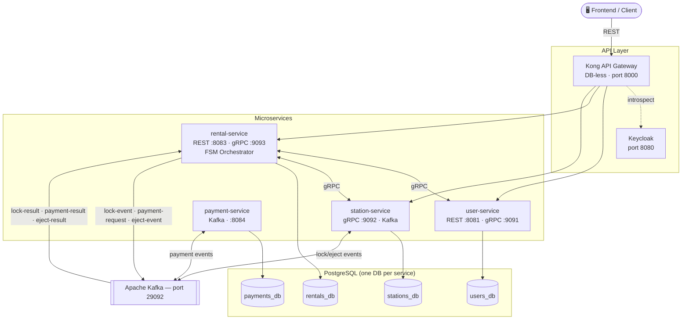

# Powerbank Sharing Platform

MVP of a powerbank sharing system — microservices with
Spring Boot, Kafka, gRPC, Keycloak, and Kong.

## Tech Stack
Java 21 · Spring Boot 3.2.5 · PostgreSQL · Kafka ·
gRPC · Keycloak 23 · Kong 3.7 · Liquibase · Docker

## Services

| Service | Role | REST | gRPC |
|---------|------|------|------|
| user-service | Auth + OTP + Keycloak | 8081 | 9091 |
| station-service | Stations + PowerBanks | — | 9092 |
| rental-service | FSM orchestrator | 8083 | 9093 |
| payment-service | Cards + Payments | — | — |

## Communication
- **REST** → Frontend → Kong → Services
- **gRPC**: rental-service ↔ user-service (internal)
- **Kafka** → rental ↔ station, rental ↔ payment (async)

## Rental Flow (FSM)

```
WAITING → LOCKING_STATION → PROCESSING_PAYMENT → EJECTING_POWERBANK → IN_THE_LEASE → FINISHING → DONE
                                                                                              ↘ FAILED
```

| Transition | Trigger | Action |
|-----------|---------|--------|
| WAITING → LOCKING_STATION | POST /api/v1/rentals | Publish acquire-cabinet-lock-event |
| LOCKING_STATION → PROCESSING_PAYMENT | Lock result (Kafka) | Publish payment-request |
| PROCESSING_PAYMENT → EJECTING_POWERBANK | Payment result (Kafka) | Publish eject-powerbank-event |
| EJECTING_POWERBANK → IN_THE_LEASE | Eject result (Kafka) | Set powerBankId + startedAt |
| IN_THE_LEASE → DONE | POST /api/v1/rentals/finish | Charge 100 UZS/min (min 5 000 UZS) |

## Architecture



## Kafka Topics

| Topic | Producer | Consumer |
|-------|----------|----------|
| acquire-cabinet-lock-event | rental-service | station-service |
| acquire-cabinet-lock-result | station-service | rental-service |
| eject-powerbank-event | rental-service | station-service |
| eject-powerbank-result | station-service | rental-service |
| payment-request | rental-service | payment-service |
| payment-result | payment-service | rental-service |
| payment-events | payment-service | — |

## Quick Start

```bash
# 1. Clone
git clone https://github.com/yusufjon-akhmedov/powerbank-sharing.git
cd powerbank-sharing

# 2. Configure
cp .env.example .env

# 3. Start infrastructure
docker-compose up -d
```

> **Note (macOS only):** If PostgreSQL is already running locally
> on port 5432, stop it first:
> ```bash
> brew services stop postgresql@18
> ```

```bash
# 4. Fix Keycloak DB permissions
docker exec postgres psql -U postgres -c "CREATE USER keycloak WITH PASSWORD 'keycloak';"
docker exec postgres psql -U postgres -c "GRANT ALL PRIVILEGES ON DATABASE keycloak_db TO keycloak;"
docker exec postgres psql -U postgres -d keycloak_db -c "GRANT ALL ON SCHEMA public TO keycloak;"
docker exec postgres psql -U postgres -d keycloak_db -c "ALTER DATABASE keycloak_db OWNER TO keycloak;"
docker restart keycloak

# 5. Create Keycloak realm
TOKEN=$(curl -s -X POST http://localhost:8080/realms/master/protocol/openid-connect/token \
  -H "Content-Type: application/x-www-form-urlencoded" \
  -d "username=admin&password=admin&grant_type=password&client_id=admin-cli" \
  | python3 -c "import sys,json; print(json.load(sys.stdin)['access_token'])")

curl -s -X POST http://localhost:8080/admin/realms \
  -H "Authorization: Bearer $TOKEN" -H "Content-Type: application/json" \
  -d '{"realm":"powerbank-realm","enabled":true}'

curl -s -X POST http://localhost:8080/admin/realms/powerbank-realm/clients \
  -H "Authorization: Bearer $TOKEN" -H "Content-Type: application/json" \
  -d '{"clientId":"powerbank-app","enabled":true,"publicClient":true,"directAccessGrantsEnabled":true,"redirectUris":["*"]}'

# 6. Build
mvn clean install -DskipTests

# 7. Run (each in separate terminal)
cd user-service    && mvn spring-boot:run
cd station-service && mvn spring-boot:run
cd rental-service  && mvn spring-boot:run
cd payment-service && mvn spring-boot:run
```

## API

```bash
# Request OTP (check server logs for code)
curl -X POST http://localhost:8081/auth/phone \
  -H "Content-Type: application/json" \
  -d '{"phone": "+998901234567"}'

# Verify OTP → get JWT
curl -X POST http://localhost:8081/auth/verify \
  -H "Content-Type: application/json" \
  -d '{"phone": "+998901234567", "otp": "123456"}'
```

First, get station and card IDs from the database:
```bash
docker exec postgres psql -U postgres -d stations_db \
  -c "SELECT id, name FROM stations;"

docker exec postgres psql -U postgres -d payments_db \
  -c "SELECT id, user_id, balance FROM cards;"
```
Use the IDs from the output in the request body below.
Note: change `idempotencyKey` value for each new rental.

```bash
# Create rental
curl -X POST http://localhost:8083/api/v1/rentals \
  -H "Authorization: Bearer <token>" -H "Content-Type: application/json" \
  -d '{"stationId":"<uuid>","cardId":"<uuid>","idempotencyKey":"key-001"}'

# Check status
curl http://localhost:8083/api/v1/rentals/<id>/status \
  -H "Authorization: Bearer <token>"

# Finish rental
curl -X POST http://localhost:8083/api/v1/rentals/finish \
  -H "Authorization: Bearer <token>" -H "Content-Type: application/json" \
  -d '{"rentalId":"<uuid>","stationId":"<uuid>"}'
```

Swagger UI: `http://localhost:8081/swagger-ui/index.html` (user) · `http://localhost:8083/swagger-ui/index.html` (rental)

## Test Data (auto-seeded)

**Stations** — Amir Temur Maydoni · Yunusabad Metro · Chilanzar DC

**Cards** — test-user-1: 500 000 UZS · test-user-2: 100 UZS (insufficient funds test)

```bash
docker exec postgres psql -U postgres -d stations_db -c "SELECT id, name FROM stations;"
docker exec postgres psql -U postgres -d payments_db -c "SELECT id, user_id, balance FROM cards;"
```

## Infrastructure

| | URL |
|-|-----|
| Keycloak | http://localhost:8080 |
| Kong Proxy | http://localhost:8000 |
| Kong Admin | http://localhost:8001 |
| PostgreSQL | localhost:5432 |
| Kafka | localhost:29092 |

## Notes
- OTP logged to console in dev mode (Telegram planned)
- `getNearbyStations` returns all ACTIVE stations (PostGIS planned)
- Outbox pattern not implemented → see [DECISIONS.md](DECISIONS.md)
