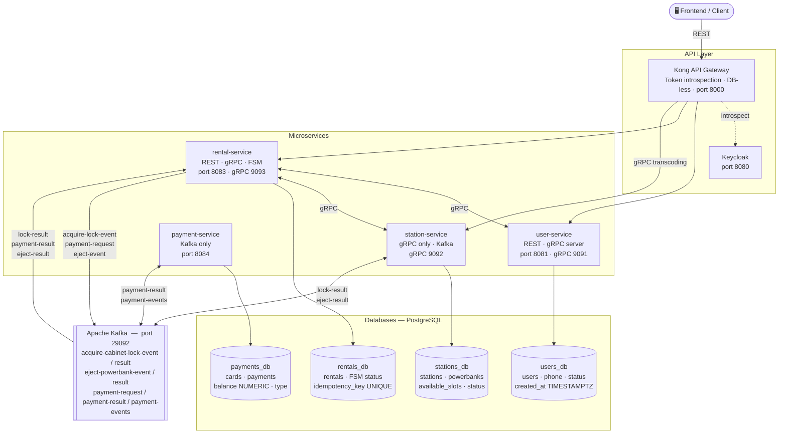

# Powerbank Sharing Platform

## Overview
MVP of a powerbank sharing system built with microservices architecture.
Users can rent powerbanks from stations, pay automatically, and return them.

## Architecture



### Services
| Service | Description | REST Port | gRPC Port |
|---------|-------------|-----------|-----------|
| user-service | Authentication via Keycloak + OTP | 8081 | 9091 |
| station-service | Station & powerbank management | — | 9092 |
| rental-service | Rental lifecycle (FSM) | 8083 | 9093 |
| payment-service | Card & payment processing | 8084 | — |

### Communication
- **REST**: Frontend → Kong API Gateway → Services
- **gRPC**: rental-service ↔ user-service, rental-service ↔ station-service
- **Kafka**: rental-service ↔ station-service, rental-service ↔ payment-service

### Tech Stack
- Java 21, Spring Boot 3.2.5
- PostgreSQL 16 (separate DB per service)
- Apache Kafka 3.6
- Keycloak 23.0 (OAuth2 + JWT)
- Kong 3.7 (API Gateway, DB-less mode)
- gRPC + Protocol Buffers
- Liquibase (DB migrations)
- Docker + Docker Compose

## Rental Flow (FSM)

```
WAITING → LOCKING_STATION → PROCESSING_PAYMENT → EJECTING_POWERBANK → IN_THE_LEASE → FINISHING → DONE
                                                                                            ↘ FAILED (any step)
```

| Step | Trigger | Action |
|------|---------|--------|
| WAITING → LOCKING_STATION | POST /api/v1/rentals | Publish acquire-cabinet-lock-event |
| LOCKING_STATION → PROCESSING_PAYMENT | Lock result (Kafka) | Publish payment-request |
| PROCESSING_PAYMENT → EJECTING_POWERBANK | Payment result (Kafka) | Publish eject-powerbank-event |
| EJECTING_POWERBANK → IN_THE_LEASE | Eject result (Kafka) | Set powerBankId, startedAt |
| IN_THE_LEASE → FINISHING → DONE | POST /api/v1/rentals/finish | Calculate amount (100 UZS/min, min 5000 UZS) |

## Kafka Topics
| Topic | Producer | Consumer |
|-------|----------|----------|
| acquire-cabinet-lock-event | rental-service | station-service |
| acquire-cabinet-lock-result | station-service | rental-service |
| payment-request | rental-service | payment-service |
| payment-result | payment-service | rental-service |
| eject-powerbank-event | rental-service | station-service |
| eject-powerbank-result | station-service | rental-service |
| payment-events | payment-service | — |

## Prerequisites
- Java 21+
- Maven 3.9+
- Docker & Docker Compose

## Quick Start

### 1. Clone the repository
```bash
git clone https://github.com/yusufjon-akhmedov/powerbank-sharing.git
cd powerbank-sharing
```

### 2. Create .env file
```bash
cp .env.example .env
```

### 3. Start infrastructure
```bash
docker-compose up -d
```

Wait for all containers to be healthy:
```bash
docker-compose ps
```

### 4. Fix Keycloak database permissions
```bash
docker exec postgres psql -U postgres -c "CREATE USER keycloak WITH PASSWORD 'keycloak';"
docker exec postgres psql -U postgres -c "GRANT ALL PRIVILEGES ON DATABASE keycloak_db TO keycloak;"
docker exec postgres psql -U postgres -d keycloak_db -c "GRANT ALL ON SCHEMA public TO keycloak;"
docker exec postgres psql -U postgres -d keycloak_db -c "ALTER DATABASE keycloak_db OWNER TO keycloak;"
docker restart keycloak
```

### 5. Setup Keycloak realm
```bash
TOKEN=$(curl -s -X POST http://localhost:8080/realms/master/protocol/openid-connect/token \
  -H "Content-Type: application/x-www-form-urlencoded" \
  -d "username=admin&password=admin&grant_type=password&client_id=admin-cli" \
  | python3 -c "import sys,json; print(json.load(sys.stdin)['access_token'])")

curl -s -X POST http://localhost:8080/admin/realms \
  -H "Authorization: Bearer $TOKEN" \
  -H "Content-Type: application/json" \
  -d '{"realm":"powerbank-realm","enabled":true}'

curl -s -X POST http://localhost:8080/admin/realms/powerbank-realm/clients \
  -H "Authorization: Bearer $TOKEN" \
  -H "Content-Type: application/json" \
  -d '{"clientId":"powerbank-app","enabled":true,"publicClient":true,"directAccessGrantsEnabled":true,"redirectUris":["*"]}'
```

### 6. Build all modules
```bash
mvn clean install -DskipTests
```

### 7. Run services (each in separate terminal)
```bash
cd user-service && mvn spring-boot:run
cd station-service && mvn spring-boot:run
cd rental-service && mvn spring-boot:run
cd payment-service && mvn spring-boot:run
```

## API Documentation (Swagger)
- user-service: http://localhost:8081/swagger-ui/index.html
- rental-service: http://localhost:8083/swagger-ui/index.html

## API Usage

### 1. Request OTP
```bash
curl -X POST http://localhost:8081/auth/phone \
  -H "Content-Type: application/json" \
  -d '{"phone": "+998901234567"}'
```
Check server logs for OTP (development mode).

### 2. Verify OTP and get JWT
```bash
curl -X POST http://localhost:8081/auth/verify \
  -H "Content-Type: application/json" \
  -d '{"phone": "+998901234567", "otp": "123456"}'
```

### 3. Create rental
```bash
curl -X POST http://localhost:8083/api/v1/rentals \
  -H "Authorization: Bearer <access_token>" \
  -H "Content-Type: application/json" \
  -d '{"stationId": "<station-uuid>", "cardId": "<card-uuid>", "idempotencyKey": "unique-key-001"}'
```

### 4. Check rental status
```bash
curl http://localhost:8083/api/v1/rentals/<rental-id>/status \
  -H "Authorization: Bearer <access_token>"
```

### 5. Finish rental
```bash
curl -X POST http://localhost:8083/api/v1/rentals/finish \
  -H "Authorization: Bearer <access_token>" \
  -H "Content-Type: application/json" \
  -d '{"rentalId": "<rental-id>", "stationId": "<station-uuid>"}'
```

## Test Data
After startup, test data is auto-seeded:

**Stations** (Tashkent):
- Amir Temur Maydoni
- Yunusabad Metro
- Chilanzar DC

**Cards**:
- test-user-1: 500,000 UZS balance
- test-user-2: 100 UZS balance (for insufficient funds test)

Get IDs:
```bash
docker exec postgres psql -U postgres -d stations_db -c "SELECT id, name FROM stations;"
docker exec postgres psql -U postgres -d payments_db -c "SELECT id, user_id, balance FROM cards;"
```

## Infrastructure URLs
| Service | URL |
|---------|-----|
| Keycloak Admin | http://localhost:8080 |
| Kong Proxy | http://localhost:8000 |
| Kong Admin | http://localhost:8001 |
| PostgreSQL | localhost:5432 |
| Kafka | localhost:29092 |

## Project Structure

```
powerbank-sharing/
├── proto/                    # Shared gRPC protobuf definitions
├── common/                   # Shared utilities
├── user-service/             # Auth, OTP, Keycloak
├── station-service/          # Stations, PowerBanks, slot management
├── rental-service/           # Rental FSM orchestrator
├── payment-service/          # Cards, payments, idempotency
├── infra/
│   ├── kong/kong.yml         # Kong declarative config
│   └── postgres/             # Multi-DB init script
├── docker-compose.yml
├── .env.example
└── DECISIONS.md              # Architecture decision records
```

## Notes
- OTP is logged to console in development mode (Telegram integration planned)
- Station geo-radius filtering returns all ACTIVE stations (PostGIS planned)
- Outbox pattern not implemented (noted in DECISIONS.md)
